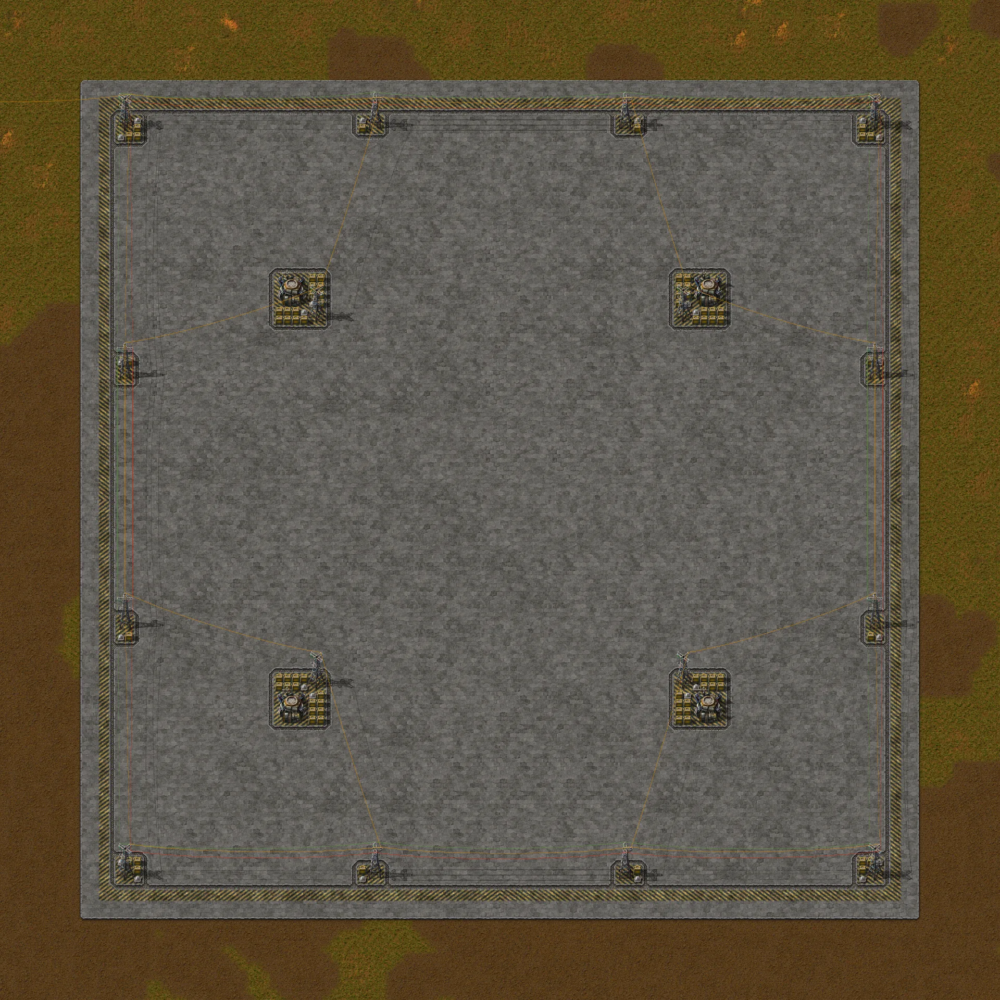
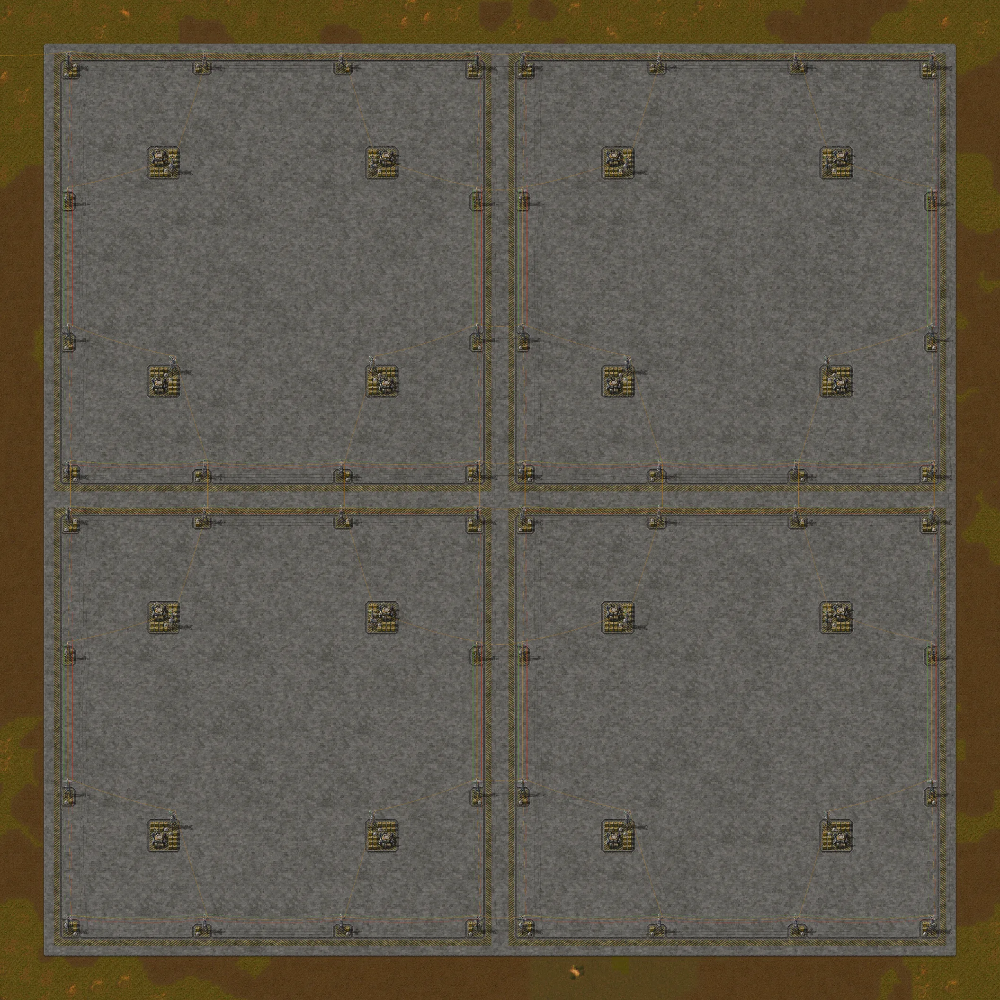
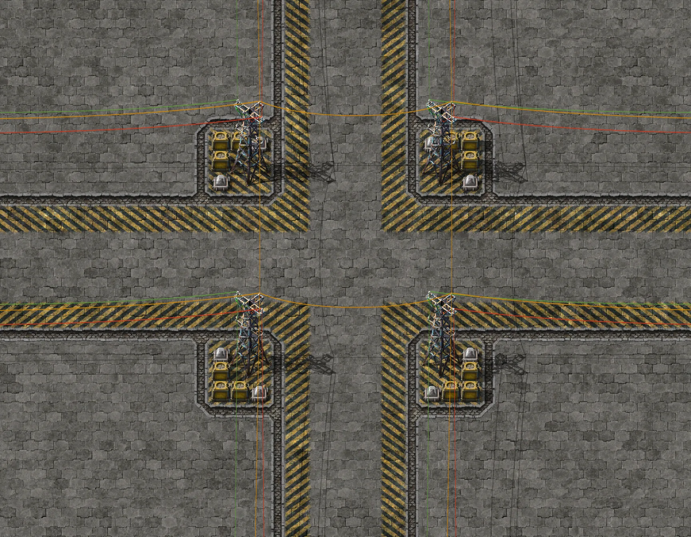
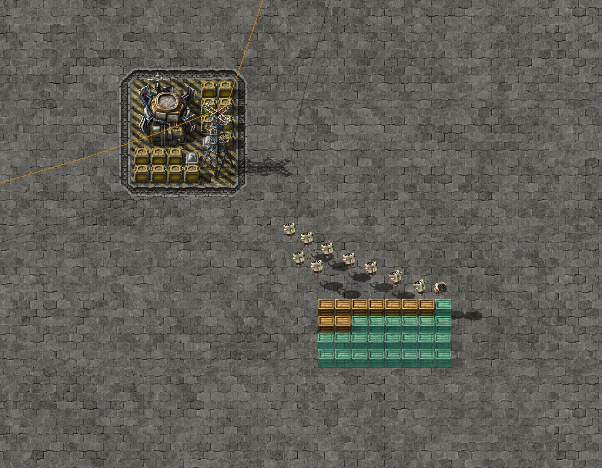

# 100 × 100 robot-only city block, full concrete

A lot template for a robot-only city in Factorio 2.0.77, base game (no Space Age): a 100 × 100-tile block with
4 roboports, a standard edge, electric poles, lighting and a logistic network. Blocks repeat every 100 tiles
and fit together seamlessly, and the interior of the lot is free for whatever you want to build. There are no rails, no station, no power
generation and no robots: it is only the robot infrastructure.

- File: [`city-block-100x100-full-concrete.txt`](city-block-100x100-full-concrete.txt) (full concrete: refined concrete over the whole lot). In-game, its name is `City block 100x100 (full concrete)`.
- The other variant, [partial concrete](../city-block-100x100-partial-concrete/), is a separate blueprint: the entities and wires are identical and only the flooring changes. The two can be placed side by side (see "Boundary between neighboring blocks").
- This is always the current version. Earlier versions are in the git history (`git log -p -- blueprints/city-block-100x100-full-concrete/`).



## What's inside

| Item | Value |
|---|---|
| Entities | 120 |
| Area | 100 × 100 tiles |
| Roboports | 4, at (25, 25), (75, 25), (25, 75) and (75, 75) (blueprint coordinates, in tiles from the block's northwest corner) |
| Big electric poles | 16: 12 on the edge, every 30 tiles, and 4 next to the roboports |
| Lamps | 24: 2 at each corner, 1 at each intermediate edge pole and 2 at each roboport |
| Storage chests, unfiltered | 76, empty: 14 around each roboport and 20 next to the edge poles |
| Wires | 44: 20 copper (12 in the edge ring and 8 from the inner poles), 12 red and 12 green |

The storage chests are the logistic network's stock: according to the game, they store the items taken from player trash slots and deconstruction orders, and whatever is in them is also provided for construction and logistic orders. In the test, the robots built with items taken from one of them.

Flooring, in units of the item that places it:

| Floor | Units |
|---|---|
| Refined concrete | 8,808 |
| Refined hazard concrete | 608 |
| Stone path (stone brick) | 584 |
| Total tiles | 10,000 |

The rest of the materials: 76 storage chests, 24 lamps, 16 big electric poles and 4 roboports.

## How the block is laid out

- **Grid snapping**: the blueprint uses absolute snapping to the 100 × 100 grid. Each copy lands in the 100 × 100 cell under the cursor, so neighboring blocks do not overlap.
- **Edge**: a 6-tile strip on each side. From the outside in: 2 of refined concrete, 1 of refined hazard concrete, 1 of stone path and 2 of refined concrete. Two neighboring blocks join their edges and leave a 12-tile street between them.
- **Roboport pads**: each roboport sits on a 12 × 12-tile pad: a 6 × 6 core of refined hazard concrete, which holds the roboport, the chests, the pole and the lamps, surrounded by 1 tile of stone path and another 2 of refined concrete.
- **Pole pads**: each of the 12 edge poles has its own pad, with the same design as the roboport pads on a smaller scale: a core of refined hazard concrete, with 1 tile of stone path and 2 of refined concrete around it. The pad covers the pole, the lamps and the chests and extends into the lot beyond the 6-tile strip: 3 tiles at the intermediate poles and 4 at the corners, the same at all four corners.
- **Power**: the 12 edge poles form a copper ring; each of the 4 inner poles connects to 2 poles of the ring. The poles of neighboring blocks are 10 tiles apart (95 → 105), so the power connection between blocks is made automatically on construction (4 copper wires on each side two blocks share). The block does not generate power: connect an edge pole to your electric network. Consumption is 200 kW idle (4 roboports × 50 kW), plus 120 kW from the lamps at night (24 × 5 kW). Each roboport draws up to 5 MW from the network (its max input) while it fills its 100 MJ buffer, and charging robots uses 500 kW per charging station (there are 4 per roboport, up to 2 MW).
- **Circuit**: the edge ring also has red and green wires on the 12 poles. Each block has its own circuit network, with no connection to the neighbor's.
- **Roboport range**: in the base game, the roboport has a logistic radius of 25 (a 50 × 50 area) and a construction radius of 55 (a 110 × 110 area). The logistic areas of the 4 roboports touch and cover the whole lot; the construction areas cover 160 × 160 tiles, 30 beyond each edge.



## Boundary between neighboring blocks

Each side of the block mirrors the opposite side, with the hazard stripes reversing direction. So when two blocks meet, the two 6-tile edges form a gap-free 12-tile street, with the hazard stripes and the stone paths at the same distance from the center line of the street, and where four blocks meet, the four corner pads mirror each other.

Tested in-game tile by tile, with blocks in 2 × 1, 1 × 2, 2 × 2 and 3 × 3, and also with full concrete and partial concrete alternating in a checkerboard (2 × 1, 2 × 2 and 3 × 3):

| Check | Result |
|---|---|
| Seams | at each seam, the tile N tiles away on one side mirrors the tile N tiles away on the other side: 0 differences in 35 seams (18 with this block only, looking 50 tiles into each side, that is, up to the middle of each block; 17 in the checkerboard, looking only at the 6-tile edge) |
| Street | all 12 tiles of the street are paved, with no gaps, at every seam |
| Construction | with 1, 2, 4 and 9 blocks: every entity and tile at its blueprint position, 0 ghosts left, no overlap |
| Power | the poles of all blocks form 1 electric network, with 4 copper wires on each shared side (in the 3 × 3: 180 from the blocks plus 48 between them) |
| Logistic network | the roboports of all blocks form 1 network (36 in the 3 × 3) and the chests are all inside it (684) |
| Robots | built 4 of 4 wooden chest ghosts on top of the seam, with the wooden chests stored in a storage chest of one of the blocks |



## Results measured in-game

Automated test in headless Factorio 2.0.77 (`scenarios/city-test`, 254 checks), with both variants. Each block is built far from the center of its cell, to prove the grid snapping. Power comes from a pole and an electric energy interface outside the block, connected to an edge pole; in the screenshots that show the top-left corner of the first block (overview, corner at night and 2 × 2), the copper wire coming in there is the one that connects the block to that source, which is out of frame. Each roboport received 10 construction robots and 10 logistic robots. The numbers below are for one block and for four blocks (2 × 2, 200 × 200 tiles).

| Check | Result |
|---|---|
| Import | the string imports without errors: 120 entities and 10,000 tiles, with absolute snapping to the 100 × 100 grid |
| Construction | every entity and tile at its blueprint position and the same number of wires as the blueprint (per block: 20 copper, 12 red and 12 green), 0 ghosts left, with 1 and with 4 blocks, no overlap; with 4 blocks, plus 16 copper wires between neighboring blocks |
| Electric network | the 16 poles form 1 network; the 64 poles of the 4 blocks also form just 1, connected automatically; roboports and lamps are on it |
| Roboports | each new roboport starts with 10 MJ of its 100 MJ buffer and gains about 5 MJ per second: 19.9 MJ at 2 s, 59.5 MJ at 10 s, full at 20 s. Until then the status is "Low power"; with the buffer full, all of them show "Working" |
| Lamps | 24 of 24 lit at night (96 of 96 in the 4 blocks) |
| Logistic network | the 4 roboports form 1 network (16 in the 4 blocks) and the 76 chests are inside it (304 in the 4 blocks) |
| Robots | built 4 of 4 wooden chest ghosts in the middle of the block, with the wooden chests stored in a storage chest of the block |
| Circuits | the 12 ring poles form 1 red and 1 green network per block; in the 4 blocks there are 4 networks of each color |



## Known limitations

- The block only brings the robot infrastructure: there is no production, no rails, no station and no power generation, and the interior of the lot is empty.
- Roboports and chests come empty. Put robots in the roboports and the construction items in the chests; with no items in the network, the robots do not build.
- The red and green rings do not connect between neighboring blocks. For a circuit network across the whole city, connect by hand, with red wire and green wire, one pole of each block to a pole of the neighboring block.
- Tested on flat terrain, on grass and lab tiles. Water, cliffs and trees were not tested.
- With full concrete, the whole lot comes already covered: if you want the original terrain in the interior, use the partial concrete variant.

## History

- **Publication** — the entities, wires and floors are the ones exported from the game. Only the blueprint's name and description were rewritten (typos fixed and names aligned with the site's).

## How to test

From the repository root (requires Factorio installed; see [`scripts/README.md`](../../scripts/README.md)):

```
./scripts/run_city_test.sh     # headless: imports, builds, measures power, networks, boundaries and robots
./scripts/run_city_shot.sh     # with graphics: takes the screenshots and writes images/*.webp for both variants
```

If Steam is open and not logged in, use `SteamAppId=427520 ./scripts/run_city_shot.sh`.
