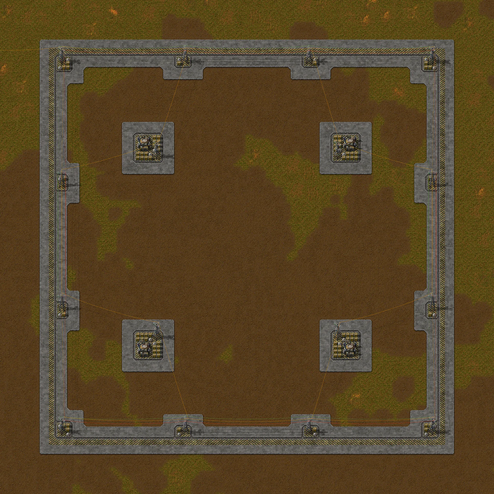
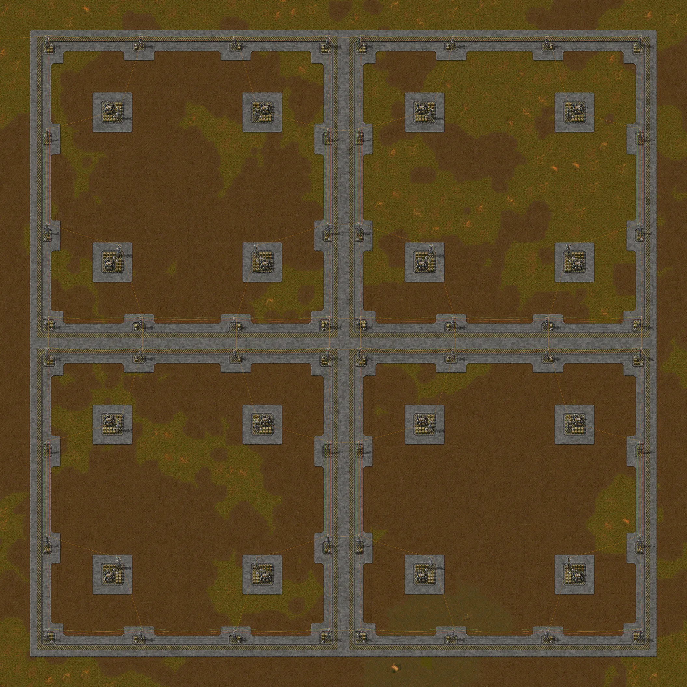
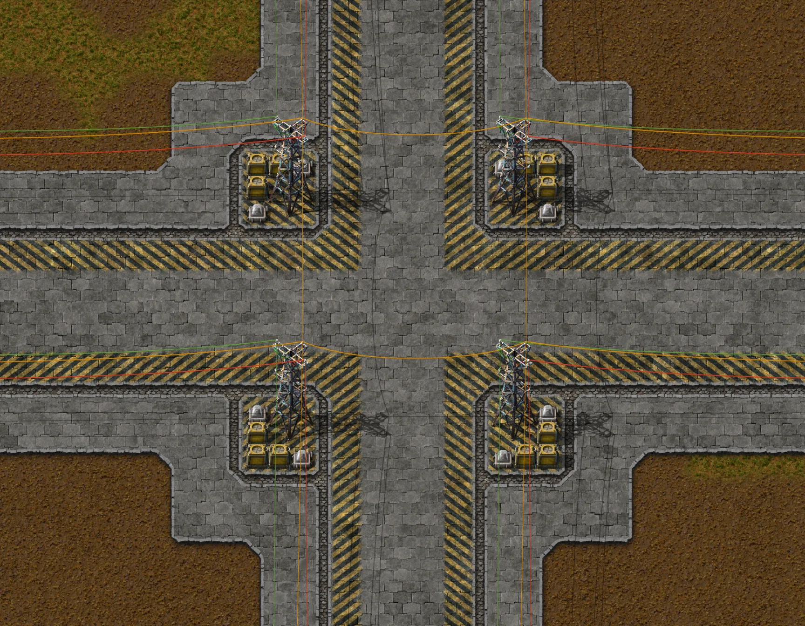
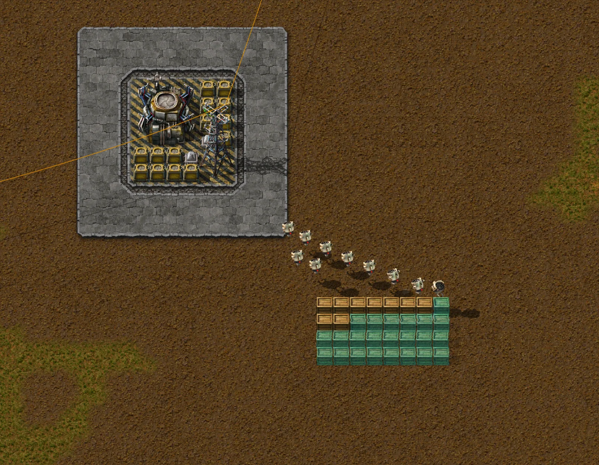

# Bloco de cidade 100 × 100 só de robôs, concreto parcial

Modelo de lote para uma cidade só de robôs no Factorio 2.0.77, jogo base (sem Space Age): um bloco de 100 × 100 tiles com
4 roboports, borda padronizada, postes de energia, iluminação e rede logística. Os blocos se repetem de 100 em 100 tiles,
encaixam sem emenda, e o interior do lote fica livre para o que você quiser construir. Não há trilhos, estação, geração de
energia nem robôs: é só a base de robôs.

- Arquivo: [`city-block-100x100-partial-concrete.txt`](city-block-100x100-partial-concrete.txt) (concreto parcial: só a borda e as bases dos postes e dos roboports têm piso; o interior do lote fica com o terreno original). No jogo o nome é `City block 100x100 (partial concrete)`.
- A outra variante, [concreto total](../city-block-100x100-full-concrete/), é uma blueprint à parte: as entidades e os fios são idênticos e só o piso muda. As duas podem ser postas lado a lado (ver "Fronteira entre blocos vizinhos").
- Esta é sempre a versão atual. Versões anteriores ficam no histórico do git (`git log -p -- blueprints/city-block-100x100-partial-concrete/`).



## O que tem dentro

| Item | Valor |
|---|---|
| Entidades | 120 |
| Área | 100 × 100 tiles |
| Roboports | 4, em (25, 25), (75, 25), (25, 75) e (75, 75) (coordenadas da blueprint, em tiles a partir do canto noroeste do bloco) |
| Postes grandes | 16: 12 na borda, a cada 30 tiles, e 4 ao lado dos roboports |
| Lâmpadas | 24: 2 em cada canto, 1 em cada poste intermediário da borda e 2 em cada roboport |
| Baús de armazenagem, sem filtro | 76, vazios: 14 ao redor de cada roboport e 20 junto aos postes da borda |
| Fios | 44: 20 de cobre (12 no anel da borda e 8 dos postes internos), 12 vermelhos e 12 verdes |

Os baús de armazenagem são o estoque da rede logística: segundo o jogo, guardam os itens que saem do inventário de lixo do jogador e das ordens de desconstrução, e o que está neles também é fornecido a pedidos de construção e de logística. No teste, os robôs construíram com itens tirados de um deles.

Piso, em unidades do item que o coloca:

| Piso | Unidades |
|---|---|
| Concreto refinado | 1.920 |
| Concreto refinado com marca de perigo | 608 |
| Calçada de pedra (tijolo de pedra) | 584 |
| Tiles no total | 3.112 |

O resto dos materiais: 76 baús de armazenagem, 24 lâmpadas, 16 postes grandes e 4 roboports.

## Como o bloco é montado

- **Alinhamento**: a blueprint usa alinhamento absoluto à grade de 100 × 100. Cada cópia cai na célula de 100 × 100 sob o cursor, então blocos vizinhos não se sobrepõem.
- **Borda**: uma faixa de 6 tiles em cada lado. Da parte de fora para a de dentro: 2 de concreto refinado, 1 de concreto refinado com marca de perigo, 1 de calçada de pedra e 2 de concreto refinado. Dois blocos vizinhos juntam as bordas e deixam uma rua de 12 tiles entre eles.
- **Bases dos roboports**: cada roboport fica numa base de 12 × 12 tiles: um miolo de 6 × 6 de concreto refinado com marca de perigo, onde ficam o roboport, os baús, o poste e as lâmpadas, cercado por 1 tile de calçada de pedra e mais 2 de concreto refinado.
- **Bases dos postes**: cada um dos 12 postes da borda tem uma base própria, no mesmo desenho das bases dos roboports em escala menor: miolo de concreto refinado com marca de perigo, 1 tile de calçada de pedra e 2 de concreto refinado em volta. Ela cobre o poste, as lâmpadas e os baús e avança para dentro do lote além da faixa de 6 tiles: 3 tiles nos postes intermediários e 4 nos cantos, igual nos quatro cantos.
- **Energia**: os 12 postes da borda formam um anel de cobre; cada um dos 4 postes internos liga-se a 2 postes do anel. Os postes de blocos vizinhos ficam a 10 tiles um do outro (95 → 105), então a ligação de energia entre blocos se faz sozinha ao construir (4 fios de cobre em cada lado que dois blocos compartilham). O bloco não gera energia: ligue um poste da borda à sua rede elétrica. O consumo é de 200 kW parado (4 roboports × 50 kW), mais 120 kW das lâmpadas à noite (24 × 5 kW). Cada roboport puxa até 5 MW da rede (limite de entrada) enquanto enche o buffer de 100 MJ, e carregar robôs gasta 500 kW por estação de carregamento (são 4 por roboport, até 2 MW).
- **Circuito**: o anel da borda também tem fios vermelho e verde nos 12 postes. Cada bloco tem a sua rede de circuitos, sem ligação com a do vizinho.
- **Alcance dos roboports**: no jogo base o roboport tem raio logístico 25 (área de 50 × 50) e raio de construção 55 (área de 110 × 110). As áreas logísticas dos 4 roboports se encostam e cobrem o lote inteiro; as de construção cobrem 160 × 160 tiles, 30 além de cada borda.



## Fronteira entre blocos vizinhos

Cada lado do bloco é o espelho do lado oposto, com as faixas de perigo trocando de sentido. Por isso, ao encostar dois blocos, as duas bordas de 6 tiles formam uma rua de 12 tiles sem falhas, com as faixas de perigo e as calçadas de pedra à mesma distância do eixo da rua, e no encontro de quatro blocos as quatro bases de canto ficam espelhadas.

Testado no jogo tile a tile, com blocos em 2 × 1, 1 × 2, 2 × 2 e 3 × 3, e também com o concreto parcial e o concreto total alternados em xadrez (2 × 1, 2 × 2 e 3 × 3):

| Verificação | Resultado |
|---|---|
| Emendas | em cada emenda, o tile a N tiles de um lado é o espelho do tile a N tiles do outro lado: 0 diferenças em 35 emendas (18 só com este bloco, olhando 50 tiles para dentro de cada lado, ou seja, até o meio de cada bloco; 17 no xadrez, olhando só a borda de 6 tiles) |
| Rua | os 12 tiles da rua estão todos pavimentados, sem nenhuma falha, em todas as emendas |
| Construção | com 1, 2, 4 e 9 blocos: todas as entidades e tiles nas posições da blueprint, 0 fantasmas sobrando, sem sobreposição |
| Energia | os postes de todos os blocos formam 1 rede elétrica, com 4 fios de cobre em cada lado compartilhado (no 3 × 3: 180 dos blocos mais 48 entre eles) |
| Rede logística | os roboports de todos os blocos formam 1 rede (36 no 3 × 3) e os baús estão todos dentro dela (684) |
| Robôs | construíram 4 de 4 fantasmas de baú de madeira em cima da emenda, com os baús de madeira guardados num baú de armazenagem de um dos blocos |



## Resultados medidos no jogo

Teste automatizado no Factorio 2.0.77 headless (`scenarios/city-test`, 254 checagens), com as duas variantes. Cada bloco é construído longe do centro da sua célula, para provar o alinhamento à grade. A energia vem de um poste e de uma interface de energia elétrica fora do bloco, ligados a um poste da borda; nas fotos que mostram o canto superior esquerdo do primeiro bloco (visão geral, canto à noite e 2 × 2), o fio de cobre que entra por ali é o que liga o bloco a essa fonte, que fica fora do quadro. Cada roboport recebeu 10 robôs construtores e 10 logísticos. Os números abaixo são de um bloco e de quatro blocos (2 × 2, 200 × 200 tiles).

| Verificação | Resultado |
|---|---|
| Importação | a string importa sem erros: 120 entidades e 3.112 tiles, com alinhamento absoluto à grade de 100 × 100 |
| Construção | todas as entidades e tiles nas posições da blueprint e os fios em número igual ao dela (por bloco: 20 de cobre, 12 vermelhos e 12 verdes), 0 fantasmas sobrando, com 1 e com 4 blocos, sem sobreposição; com 4 blocos, mais 16 fios de cobre entre blocos vizinhos |
| Rede elétrica | os 16 postes formam 1 rede; os 64 postes dos 4 blocos também formam 1 só, ligada sozinha; roboports e lâmpadas estão nela |
| Roboports | cada roboport novo começa com 10 MJ dos 100 MJ do buffer e sobe cerca de 5 MJ por segundo: 19,9 MJ com 2 s, 59,5 MJ com 10 s, cheio com 20 s. Até lá o status é "Pouca energia"; com o buffer cheio, todos ficam "Trabalhando" |
| Lâmpadas | 24 de 24 acesas à noite (96 de 96 nos 4 blocos) |
| Rede logística | os 4 roboports formam 1 rede (16 nos 4 blocos) e os 76 baús estão dentro dela (304 nos 4 blocos) |
| Robôs | construíram 4 de 4 fantasmas de baú de madeira no meio do bloco, com os baús de madeira guardados num baú de armazenagem do bloco |
| Circuitos | os 12 postes do anel formam 1 rede vermelha e 1 verde por bloco; nos 4 blocos são 4 redes de cada cor |



## Limites conhecidos

- O bloco só traz a base de robôs: não há produção, trilhos, estação nem geração de energia, e o interior do lote fica vazio.
- Roboports e baús vêm vazios. Ponha robôs nos roboports e os itens de construção nos baús; sem itens na rede, os robôs não constroem.
- Os anéis vermelho e verde não se ligam entre blocos vizinhos. Para ter uma rede de circuitos na cidade toda, ligue à mão, com fio vermelho e fio verde, um poste de cada bloco a um poste do bloco vizinho.
- Testado em terreno plano, de grama e de laboratório. Água, penhascos e árvores não foram testados.
- Com concreto parcial, o interior do lote fica como estava (nas fotos, grama e terra).

## Histórico

- **Canto nordeste corrigido** — a versão exportada tinha 12 tiles de concreto refinado a mais na base do poste do canto nordeste, em x = 87 a 89 e y = 6 a 9. Eles foram removidos para as quatro bases de canto ficarem iguais e as emendas entre blocos ficarem espelhadas. Nada mais mudou.
- **Publicação** — as entidades, os fios e os pisos são os exportados do jogo. Só o nome e a descrição da blueprint foram reescritos (erros de digitação e nomes alinhados aos do site).

## Como testar

A partir da raiz do repositório (precisa do Factorio instalado; ver [`scripts/README.md`](../../scripts/README.md)):

```
./scripts/run_city_test.sh     # sem tela: importa, constrói, mede energia, redes, fronteiras e robôs
./scripts/run_city_shot.sh     # com tela: tira as fotos e grava images/*.webp das duas variantes
```

Se o Steam estiver aberto e sem login, use `SteamAppId=427520 ./scripts/run_city_shot.sh`.
