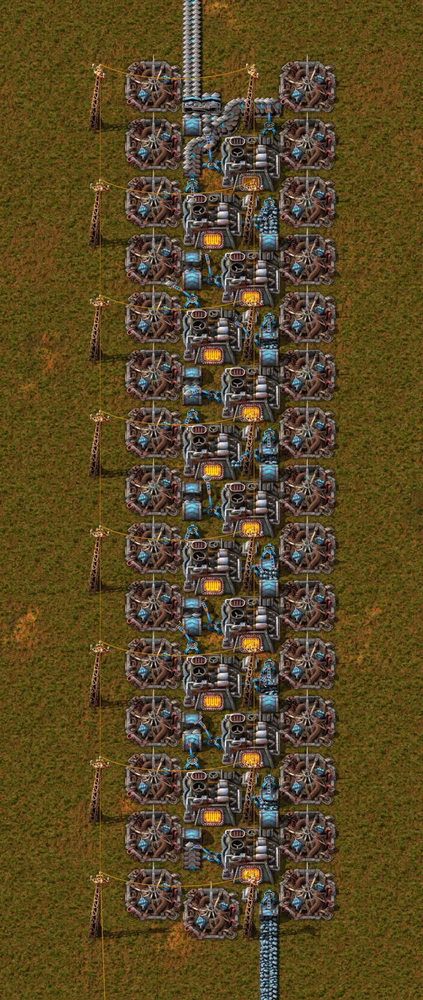

# Fundición de hierro/cobre

Fundición de placas de hierro o de cobre en hornos eléctricos con módulos de productividad 3, acelerados por faros con módulos de velocidad 3. Una línea de mena en cinta transportadora exprés entra por el sur y la línea de placas sale por el norte.

- Archivo: [`iron-copper-smelter.txt`](iron-copper-smelter.txt) — cadena de blueprint; en el juego, el nombre es `iron/copper smelter`.
- Origen: diseño de Nilaus, de la serie Master Class («Advanced Smelting (8 Beacon) 45 / sec output»), publicado por él [en esta entrada de FactorioBin](https://factoriobin.com/post/SnAX6v23) (libro «Advanced Smelting - FACTORIO MASTER CLASS»). La entrada no declara licencia. Ese libro se guardó en Factorio 1.0.0, antes de la 2.0; este blueprint está guardado y se probó en Factorio 2.0.77. El blueprint entra en el catálogo con estos créditos y este enlace por decisión del dueño del repositorio. Los créditos también aparecen, resumidos, en la página del sitio.
- Esta es siempre la versión actual. Las versiones anteriores quedan en el historial de git.

## Qué contiene

| Elemento | Valor |
|---|---|
| Entidades | 133 |
| Área | 13 × 47 casillas |
| Hornos eléctricos | 13 |
| Faros (beacons) | 31 |
| Insertadores rápidos | 27 |
| Módulos | 62 × `speed-module-3`, 26 × `productivity-module-3` |
| Postes eléctricos medianos | 16 |

La tabla enumera las piezas principales. El resto son 24 cintas transportadoras subterráneas exprés, 14 cintas transportadoras exprés, 7 lámparas y 1 divisor exprés.

## Entradas y salidas

- Entrada: una línea de mena en cinta transportadora exprés, en la columna este (x 356.5), por el borde sur, en (356.5, -246.5) en las coordenadas del blueprint, en dirección norte.
- Salida: la línea de placas sale por la columna oeste (x 352.5), cuatro casillas a la izquierda de la entrada, por el borde norte, en (352.5, -292.5), en dirección norte.
- Energía: los postes eléctricos medianos ya están conectados entre sí con cables. Conecta la red eléctrica a cualquiera de ellos.
- Sin combustible: los hornos son eléctricos.

## Resultados medidos en el juego

Medido en Factorio 2.0.77 (juego base, sin mods), con el blueprint sobre césped, mena de hierro infinita entrando por la línea de entrada (la línea quedó llena) y la línea de salida evacuando todo. Cada nivel de investigación tuvo 18.000 ticks (5 min) de calentamiento antes de medirse durante 3600 ticks (60 s), contando los objetos con las estadísticas de producción del juego y la energía con el vaciado de una reserva de energía. En las tres ventanas, las placas acumuladas en las salidas de los hornos se mantuvieron prácticamente estables (1191 → 1192, 293 → 278 y 208 → 207 placas), así que la producción medida es el caudal de la línea de salida. El caudal depende de la investigación de bonificación de capacidad de insertador (los insertadores rápidos son los únicos del blueprint), por eso hay un resultado para cada nivel:

| Investigación | Mena consumida | Placas producidas | Energía eléctrica |
|---|---|---|---|
| Ninguna (bonificación 0) | 27,75/s | 33,27/s | 29,8 MW |
| Bonificación de capacidad de insertador 2 (bonificación +1) | 37,32/s | 44,75/s | 34,0 MW |
| Bonificación de capacidad de insertador 7 (bonificación +2, el máximo) | 37,47/s | 44,95/s | 34,0 MW |

Las placas salen un 20 % por encima de la mena consumida, por los módulos de productividad 3 (2 por horno, +10 % cada uno). Con la bonificación +1 o +2, la salida llega a 44,75 y 44,95 placas/s, prácticamente una cinta transportadora exprés llena (45/s). Solo se midió la mena de hierro, pero el cobre tiene la misma receta en el juego (1 mena en 1 placa, 3,2 s), así que las cifras del cobre son las mismas.

## Cómo se probó

Probado en el juego, como se describe arriba, en una escena montada por script que difiere de una construcción de jugador en cuatro puntos: las entidades fantasma del blueprint se construyeron por script; los módulos se colocaron por script a partir de las solicitudes de objetos del blueprint (la construcción con robots no se probó); la mena viene de un cofre infinito a través de un cargador exprés; y la energía viene de una interfaz de energía conectada a un poste eléctrico grande. El cofre, el cargador, la interfaz y el poste quedan fuera de la imagen: solo el cable de cobre que sale por la esquina inferior izquierda conecta el blueprint con ellos. El escenario es `iron-copper-shot` (`scripts/ingame/data/scenarios/iron-copper-shot/control.lua`), ejecutado por `scripts/run_iron_copper_shot.sh`. El validador del catálogo también confirmó que la cadena es válida y solo usa objetos del juego base.

## Cómo probarlo

Con el juego instalado, en la carpeta `scripts/`: `./run_iron_copper_shot.sh` (con el prefijo `SteamAppId=427520` si Steam está abierto sin sesión iniciada). Hay que usar la versión con interfaz gráfica, porque la imagen se genera con el renderizador del juego. El script imprime las mediciones de la tabla de arriba (unos 90 s) y rehace `images/overview.webp`.

## Límites conocidos

- La descripción guardada en la cadena que llegó al catálogo (pegada por el dueño del repositorio) decía «Consumes 45/s» y «Produces 45/s» (una cinta transportadora exprés llena). La salida de 45/s está confirmada (44,95 placas/s como máximo), pero la entrada no: con +20 % de productividad, 45 placas/s requieren 37,5 de mena/s, y el máximo medido fue 37,47/s.
- Por eso, el catálogo reescribió esa descripción: ahora da crédito a Nilaus, incluye el enlace e indica 37,5/s de entrada y 45/s de salida, con los valores medidos. El nombre (etiqueta) de la cadena no se cambió: ya venía distinto del nombre del diseño en el libro de FactorioBin. El resto del contenido de la cadena, decodificado, es idéntico al de la cadena que llegó (verificado por script), y la cadena corregida se importó y se midió en el juego con los mismos resultados.
- Una línea de entrada con menos de 37,47 de mena/s deja la fundición por debajo del máximo.
- Sin la investigación de bonificación de capacidad de insertador, la salida baja a 33,27 placas/s.
- La prueba usó un solo tipo de mena en la línea (hierro).
- Los módulos vienen como solicitud de objetos en el blueprint: al pegarlo con robots, la red logística necesita tener 62 `speed-module-3` y 26 `productivity-module-3` almacenados.
