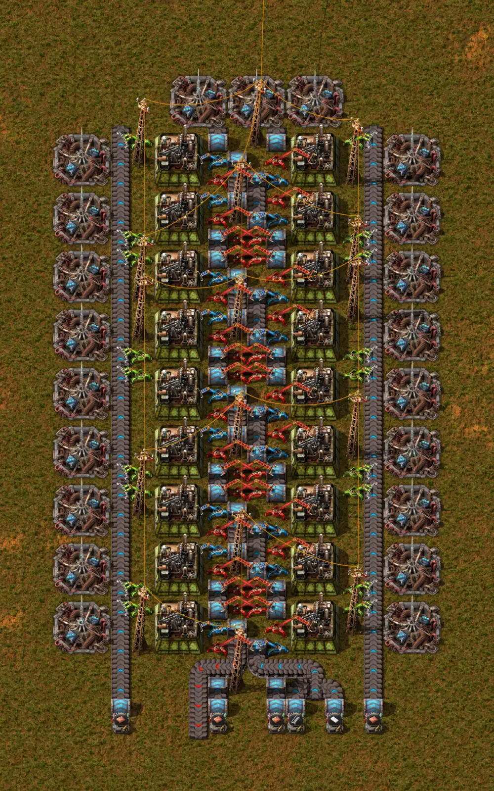

# Low density structure factory

Two columns of assembling machines 3 with productivity modules 3, sped up by beacons with speed modules 3, that make low density structures. It takes copper plates, steel plates and plastic bars from the south and delivers 6.28 structures per second (377 per minute), also to the south.

- File: [`low-density-structure-factory.txt`](low-density-structure-factory.txt) — blueprint string; in-game, its name is `Low density structure factory`.
- This is always the current version. Earlier versions live in the git history.

## What's inside

| Item | Value |
|---|---|
| Entities | 255 |
| Area | 20 × 34 tiles |
| Assembling machines 3 | 18 |
| Beacons | 21 |
| Modules | 72 × `productivity-module-3`, 42 × `speed-module-3` |
| Inserters | 34 long-handed, 18 bulk, 18 fast |
| Express transport belts | 73 |
| Express underground belts | 44 |

The rest are 16 medium electric poles, 7 fast transport belts (the output) and 6 display panels, which mark the item of each input.

## Inputs and outputs

- Inputs: six express underground belt exits on the south edge, facing north, each right above a display panel with the item's icon. From west to east: copper plate, copper plate, copper plate, steel plate, plastic bar, copper plate. Place the entrance of each underground belt south of its display panel.
- Output: the fast transport belt that runs down through the south edge, between the first and the second copper input.
- Power: the medium electric poles are already wired to each other. Connect the electric network to any of them.
- Research: it needs “Inserter capacity bonus 2”.

## Results measured in-game

Measured in Factorio 2.0.77 (base game, no mods), with the six inputs full (a complete express transport belt on each) and the output always free. Each research level had 36,000 ticks (10 min) of warm-up before being measured for 216,000 ticks (60 min); the items were counted with the game's production statistics and the power by the drain on an energy buffer. Output depends on the inserter capacity bonus research, so there is one result per level:

| Research | Copper plates | Steel plates | Plastic bars | Structures produced | Electric power |
|---|---|---|---|---|---|
| No capacity bonus | 76.84/s | 7.68/s | 19.21/s | 5.38/s | 57.71 MW |
| Inserter capacity bonus 1 | 77.48/s | 7.75/s | 19.37/s | 5.42/s | 57.65 MW |
| Inserter capacity bonus 2 | 89.73/s | 8.97/s | 22.43/s | 6.28/s | 64.21 MW |
| Inserter capacity bonus 7 (the maximum) | 89.73/s | 8.97/s | 22.43/s | 6.28/s | 63.86 MW |

From level 2 on, the 18 machines worked 99.9% to 100% of the window, and the output is the most the machines allow: 6.28 structures per second, 377 per minute. Each machine has +40% productivity (4 productivity modules 3), so each recipe yields 1.4 structures. The crafting speed is 4.25 in the two machines at the top (4 beacons each), 3.75 in the fourteen in the middle (3 beacons) and 3.15 in the two at the bottom (2 beacons).

## How it was tested

Tested in-game, as described above, in a scripted setup that differs from a player's build in four ways: the blueprint's ghosts were built by script; the modules were inserted by script from the blueprint's item requests (construction with robots was not tested); the items come from infinity chests through express loaders, and the output ends in a loader and a chest that deletes what it receives; and power comes from an electric energy interface connected, through one added pole, to the southernmost pole. The game also imported and built the blueprint and connected it to a power source for the image, which shows the blueprint built and powered, not running. The catalog validator confirmed that the string is valid and uses only base-game items (version 2.0.77).

## Corrections made here

- The string arrived with no name and no description. The catalog gave it the name `Low density structure factory` and a description with what it consumes and produces, measured in-game. The 255 entities and the wires are the same as in the original string (checked by script).
- The in-game description was longer than the 500 bytes that the game keeps when it imports a string, and the game cut the rest without warning. It was shortened so that it fits in full (checked in-game), with every number kept.

## Known limitations

- The plastic bars and the steel plates share the central belt, one lane for each item: the 22.43 plastic bars per second are very close to the maximum of one express transport belt lane (22.5/s), so the plastic input has to arrive full.
- Without the research “Inserter capacity bonus 2”, output drops to 5.38 to 5.42 structures per second.
- The measurement used the six inputs full; how much each of the four copper inputs consumes on its own was not measured.
- The modules come as item requests in the blueprint: when pasting with robots, the logistic network needs 72 `productivity-module-3` and 42 `speed-module-3` in storage.
