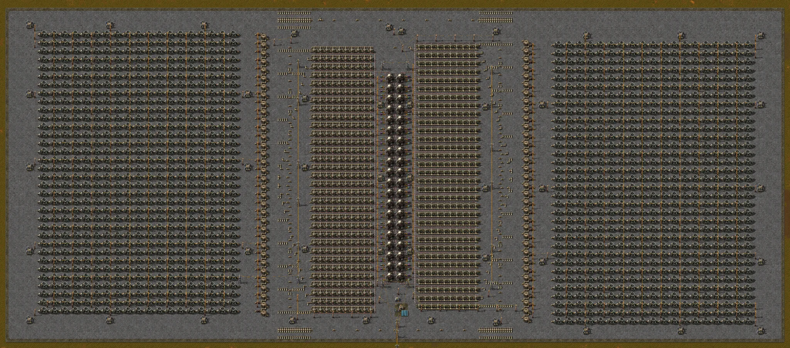

# Central nuclear de 40 reactores

Central nuclear con 40 reactores en dos columnas de 20, 640 intercambiadores de calor y 1292 turbinas de vapor; entrega hasta 6240 MW. Los robots logísticos traen las células de combustible de uranio, y un circuito en el centro del borde sur solo envía energía a la base mientras la base no pida más de lo que la central produce.

- Archivo: [`nuclear-power-plant-40-reactors-v1.txt`](nuclear-power-plant-40-reactors-v1.txt) — cadena de blueprint; en el juego se llama `Nuclear power plant - 40 reactors`.
- Origen: diseño del dueño del repositorio, adaptado de un diseño ya existente, de autor desconocido; una búsqueda en la web no encontró al autor original, así que no se conoce ninguna licencia.
- Esta es siempre la versión actual. Las versiones anteriores quedan en el historial de git.

## Qué contiene

| Elemento | Valor |
|---|---|
| Entidades | 8574 |
| Área | 370 × 159 casillas |
| Tubería térmica | 2294 |
| Tubería | 2137 |
| Tubería subterránea | 1321 |
| Turbina de vapor | 1292 |
| Intercambiador de calor | 640 |

## Lista de materiales

Todo lo que usa el blueprint, contado por el validador del catálogo a partir de la cadena:

| Elemento | Cantidad |
|---|---|
| Tubería térmica | 2294 |
| Tubería | 2137 |
| Tubería subterránea | 1321 |
| Turbina de vapor | 1292 |
| Intercambiador de calor | 640 |
| Poste eléctrico mediano | 488 |
| Insertador | 80 |
| Cisterna | 68 |
| Bomba de fluidos | 66 |
| Robopuerto | 44 |
| Cofre solicitador | 40 |
| Cofre proveedor activo | 40 |
| Reactor nuclear de fisión | 40 |
| Poste eléctrico grande | 19 |
| Acumulador | 2 |
| Combinador comparador | 1 |
| Interruptor | 1 |
| Panel solar | 1 |
| Hormigón | 57.740 |
| Hormigón con señal de peligro | 1090 |

Los cuatro bordes terminan en una franja de hormigón con señal de peligro de una casilla de ancho; justo por dentro de ella, y en todo el resto de la superficie, el suelo es de hormigón, salvo un cuadrado de 6 × 6 casillas de hormigón con señal de peligro bajo el circuito.

## Entradas

- Agua: 64 tuberías subterráneas, 32 en el borde norte y 32 en el borde sur. Conecta cada una a una fuente de agua; a plena potencia la central necesita unas 6430 unidades de agua por segundo (calculado: 10,3 por segundo en cada uno de los 624 intercambiadores de calor que hacen falta para 6240 MW).
- Combustible: 40 cofres solicitadores piden 10 células de combustible de uranio cada uno; los robots logísticos de los 44 robopuertos traen las células, y las células gastadas de combustible de uranio salen por los 40 cofres proveedores activos. El blueprint no trae robots: la red logística necesita robots logísticos, un cofre con células de combustible de uranio y un cofre que reciba las células gastadas.
- Base: conecta la base solo al poste eléctrico grande del centro del borde sur, que está después del interruptor (ver la sección siguiente).
- Arranque: un reactor solo recibe combustible de su cofre después de que sale de él una célula gastada, así que la central no arranca sola. Pon a mano una célula de combustible de uranio en cada uno de los 40 reactores y conecta una fuente de energía a un poste de la central (no al poste de salida): el blueprint viene con el interruptor abierto y los acumuladores vacíos, y las bombas de vapor y los insertadores solo funcionan con energía. En la prueba, la fuente estuvo conectada 20 minutos, hasta que se llenó el acumulador de la central.

## Cómo la central ahorra combustible

En el juego base, un reactor con combustible quema sin parar, aunque nadie use el calor. Aquí cada reactor solo recibe una célula nueva después de que se saca la gastada, y los 40 insertadores que sacan las células gastadas están conectados por un cable verde a una cisterna de la columna este de cisternas, cerca del borde sur. Cada par de reactores tiene un umbral: el primero solo se reabastece mientras esa cisterna tenga menos de 24.000 unidades de vapor, el siguiente menos de 23.000, y así sucesivamente, de 1000 en 1000, hasta 5000 en el último par. Con poca carga el vapor almacenado sube y solo queman algunos reactores; los 40 solo queman a la vez con la cisterna por debajo de 5000 unidades. Esa cisterna tiene que seguir en la red de vapor.

## Cómo el circuito protege la central

Las bombas de fluidos que llevan el vapor de las cisternas a las turbinas y los insertadores que ponen combustible en los reactores funcionan con la energía de la propia central. Si la base estuviera en la misma red eléctrica y pidiera más de lo que la central produce, la falta de energía llegaría también a esas bombas e insertadores: el vapor deja de llegar a las turbinas, la producción cae, la falta aumenta y la central colapsa.

Por eso la salida hacia la base pasa por un interruptor en el centro del borde sur:

- Un acumulador de la red de la central informa su carga al combinador comparador por un cable rojo.
- El combinador cierra el interruptor cuando la carga supera el 90 % y lo mantiene cerrado mientras sea del 50 % o más; su propia señal de salida vuelve a su entrada por un cable verde y guarda ese estado.
- Cuando la base pide más de lo que la central produce, el acumulador se descarga; por debajo del 50 %, el interruptor se abre y la base se queda sin energía, mientras la central sigue alimentando sus bombas e insertadores. Con el acumulador de nuevo por encima del 90 %, la base vuelve a recibir energía.
- El combinador tiene su propia red eléctrica, con un poste eléctrico mediano, un panel solar y otro acumulador, separada de la central y de la base.

Solo el poste eléctrico grande que está después del interruptor tiene esta protección. Conectar la base a cualquier otro poste de la central une las dos redes y deshace la protección.

## Resultados medidos en el juego

Medido en Factorio 2.0.77 con la cadena corregida de esta entrada. Cada fila es la media de 18.000 ticks (5 min), después de 18.000 ticks (5 min) con la misma carga; la energía sale de las estadísticas eléctricas del juego; el agua, de sus estadísticas de fluidos; y las células quemadas, del número medio de reactores quemando, dividido entre 200 s (la duración de una célula). La potencia máxima calculada es 6240 MW: 40 reactores de 40 MW con 116 bonificaciones de vecindad del 100 %.

| Carga pedida por la base (MW) | Entregado a la base (MW) | Células quemadas | Agua |
|---|---|---|---|
| 3000 | 3000 | 0,103/s | 3177/s |
| 5000 | 5000 | 0,164/s | 5099/s |
| 6000 | 6000 | 0,200/s | 6194/s |
| 6240 | 6240 | 0,194/s | 6232/s |
| 7000, con el circuito | 6062 de media | 0,199/s | 6294/s |
| 7000, sin el circuito | 221 | 0/s | 228/s |

- Consumo a plena potencia: 0,2 células de combustible de uranio por segundo (12 por minuto, una cada 200 s por reactor) y unas 6430 unidades de agua por segundo, calculadas; la medición a 6240 MW dio 6232/s porque parte del vapor salió de las cisternas. En reposo, sin carga, la central gasta unos 2 MW en sus propios robopuertos.
- A 6000 MW la temperatura de los reactores subió durante la medición (729 → 748 °C). A 6240 MW bajó un poco (760 → 752 °C), con 38,7 de los 40 reactores quemando de media: los 6240 MW se mantuvieron durante los 10 minutos de la prueba con ayuda del vapor almacenado. Con 7000 MW pedidos, las turbinas generaron 6066 MW mientras la temperatura subía, así que la producción continua ronda los 6200 MW.
- Con 7000 MW pedidos y el circuito activo, el interruptor se abrió tres veces en 5 minutos y estuvo cerrado el 93 % del tiempo; las bombas de vapor tuvieron energía en el 91 % de las muestras, y la central siguió funcionando.
- Con el interruptor forzado a quedar cerrado (sin el circuito), la misma carga de 7000 MW hizo colapsar la central: las bombas de vapor se quedaron sin energía, ningún reactor recibió combustible y la entrega cayó a 221 MW. Con la carga reducida a 5000 MW siguió en 221 MW; solo se recuperó cuando la carga bajó a cero. Con el circuito restaurado, la central volvió a entregar 5000 MW.

## Cómo se probó

Tres ejecuciones en el juego. En la primera, el ejecutor de fotos del catálogo importó y construyó el blueprint y lo conectó a una fuente de energía; 1 grupo de postes quedó fuera del alcance de la fuente, y la prueba lo conectó a ella con un cable añadido. La imagen sale de esa ejecución y muestra el blueprint construido, no en funcionamiento.

En la segunda, un escenario de prueba hecho para esta entrada (no incluido en el repositorio) construyó el blueprint en una superficie de laboratorio siempre de día, puso agua infinita en las 64 tuberías subterráneas de entrada e hizo el papel de los robots logísticos: cada segundo completó 10 células de combustible de uranio en cada cofre solicitador y vació los cofres proveedores activos. El escenario puso una célula en cada reactor y conectó una fuente de energía temporal, retirada antes de las mediciones. En la tercera, con los reactores vacíos, la misma fuente y combustible en los cofres, ningún reactor quemó en 5 minutos; con una célula a mano en cada reactor, la central arrancó y después se reabasteció sola. La base fue una carga eléctrica ajustable conectada al poste eléctrico grande de salida. El validador del catálogo confirmó que la cadena es válida y solo usa objetos del juego base (versión 2.0.77).

## Correcciones hechas aquí

- En la columna este, a la fila de turbinas de la altura y = −157,5 le faltaba la tubería subterránea de entrada en el borde: las 19 turbinas de esa fila nunca recibían vapor. La prueba de la cadena original lo confirmó (1273 de 1292 turbinas funcionando); con la tubería subterránea añadida, funcionan las 1292.
- La cadena no tenía nombre ni descripción. Ahora el nombre es `Nuclear power plant - 40 reactors`, y la descripción, en inglés, da la potencia y el consumo medidos, las entradas y cómo conectar la base.
- La cadena original es la que proporcionó el dueño del repositorio; el resto del contenido decodificado es idéntico al de ella, comprobado por script.

## Límites conocidos

- Los bordes usan hormigón con señal de peligro normal, no hormigón refinado con señal de peligro, por decisión del dueño del repositorio.
- La red del combinador depende de un panel solar y de un acumulador; la prueba se hizo siempre de día, así que el funcionamiento de noche no se midió.
- Los robots logísticos no se probaron: la prueba puso y sacó las células de combustible por script.
- Si los cofres solicitadores se quedan sin células, la central se apaga: en la prueba, con los cofres vaciados y 5000 MW de carga, los 40 reactores se pararon y las bombas de vapor se quedaron sin energía; con 400 células de nuevo en los cofres, siguió parada 5 minutos. Hay que arrancarla otra vez, como la primera vez (ese rearranque no se probó). Mantén una reserva de células en la red logística.
- El arranque sin una fuente de energía externa no se probó.
