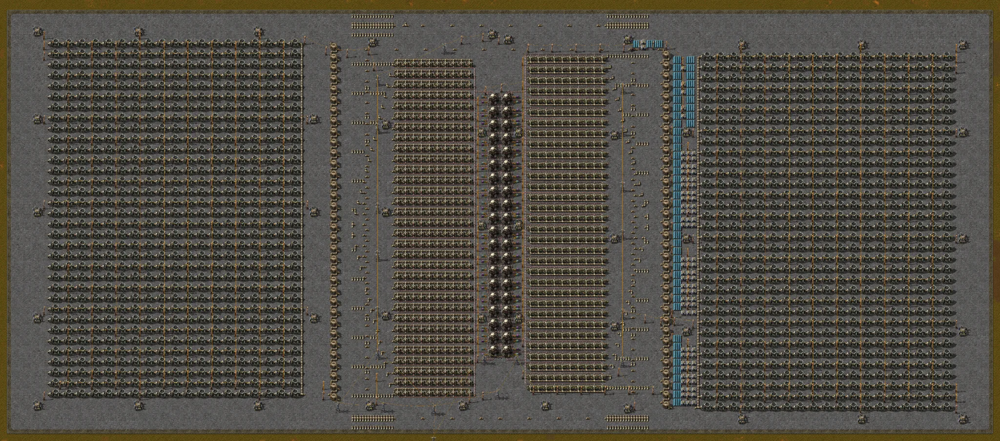

# Usina nuclear de 40 reatores com energia solar e acumuladores

Usina nuclear com 40 reatores em duas colunas de 20, 640 permutadores de calor e 1.292 turbinas a vapor, que entregou até 6.136 MW na medição. É a v2 da usina de 40 reatores: não tem o circuito de proteção da v1, e os insersores de combustível e a bomba têm uma rede própria, com painéis solares e acumuladores, separada da rede das turbinas, para continuarem funcionando mesmo que a base peça mais do que a usina produz; o dono do repositório a recomenda em vez da v1.

- Arquivo: [`nuclear-power-plant-40-reactors-v2.txt`](nuclear-power-plant-40-reactors-v2.txt) — string de blueprint; no jogo o nome é `Nuclear power plant - 40 reactors v2`.
- Origem: design do dono do repositório, adaptado de um design pronto de autor desconhecido; nenhuma licença é conhecida.
- Esta é sempre a versão atual da v2; versões anteriores dela ficam no histórico do git. A `nuclear-power-plant-40-reactors-v1`, com circuito de proteção, é outro design e continua no catálogo.

## O que tem dentro

| Item | Valor |
|---|---|
| Entidades | 8.809 |
| Área | 370 × 159 tiles |
| Tubo de calor | 2.294 |
| Cano | 2.403 |
| Cano subterrâneo | 1.205 |
| Turbina a vapor | 1.292 |
| Permutador de calor | 640 |

## Lista de materiais

Tudo o que a blueprint usa, contado pelo validador do catálogo a partir da string:

| Item | Quantidade |
|---|---|
| Concreto | 57.776 |
| Cano | 2.403 |
| Tubo de calor | 2.294 |
| Turbina a vapor | 1.292 |
| Cano subterrâneo | 1.205 |
| Concreto com sinal de perigo | 1.054 |
| Permutador de calor | 640 |
| Poste médio | 493 |
| Acumulador | 97 |
| Insersor | 80 |
| Tanque de armazenamento | 68 |
| Painel solar | 53 |
| Roboport | 44 |
| Baú solicitador | 40 |
| Baú provedor ativo | 40 |
| Reator nuclear | 40 |
| Poste grande | 19 |
| Bomba | 1 |

As quatro bordas terminam numa faixa de concreto com sinal de perigo de um tile de largura; dentro dela, em todo o resto do piso, o chão é concreto.

## Diferenças em relação à v1

Comparação com a `nuclear-power-plant-40-reactors-v1`, feita por script sobre as duas strings:

| Item | v1 | v2 |
|---|---|---|
| Bomba | 66 | 1 |
| Combinador de decisão | 1 | 0 |
| Interruptor de energia | 1 | 0 |
| Painel solar | 1 | 53 |
| Acumulador | 2 | 97 |
| Cano | 2.137 | 2.403 |
| Cano subterrâneo | 1.321 | 1.205 |
| Poste médio | 488 | 493 |

- Sem circuito de proteção: a v2 não tem o combinador de decisão nem o interruptor de energia da v1, então a base se liga direto a um poste grande da rede das turbinas.
- Uma só bomba: a v1 tinha 66 bombas entre os tanques e as turbinas, e a v2 tem uma. O vapor fica em duas metades independentes, oeste e leste, e a bomba única liga uma à outra (veja "Como o vapor é distribuído").
- Rede própria para os insersores e a bomba: os 80 insersores de combustível e a bomba ficam num grupo de postes separado do grupo das turbinas, com 53 painéis solares e 97 acumuladores (485 MJ); na v1 havia só 1 painel solar e 2 acumuladores, para o combinador.
- Igual à v1: os 40 reatores, os 640 permutadores de calor, as 1.292 turbinas, os 68 tanques, os 80 insersores, os 44 roboports, os 80 baús, as 64 entradas de água e a lógica de economia de combustível (as condições dos insersores são as mesmas).

## Entradas

- Água: 64 canos subterrâneos, 32 na borda norte e 32 na borda sul. Ligue cada um à água; na potência máxima a usina usou cerca de 6.300 unidades de água por segundo (medido: 6.326 por segundo com 7.000 MW pedidos; calculado: 10,3 por segundo em cada um dos 624 permutadores de calor necessários para 6.240 MW, ou 6.430 no total).
- Combustível: 40 baús solicitadores pedem 10 células de combustível de urânio cada; os robôs logísticos dos 44 roboports trazem as células, e as células de urânio vazias saem pelos 40 baús provedores ativos. A blueprint não traz robôs: a rede logística precisa de robôs logísticos, de um baú com células de combustível de urânio e de um baú que receba as células vazias.
- Base: ligue a base a um dos 19 postes grandes, que pertencem ao grupo das turbinas, por exemplo o do centro, a 12 tiles ao norte da borda sul. Não ligue a base aos postes dos insersores de combustível nem dos painéis solares: isso poria a demanda da base sobre eles e desfaria a separação.
- Partida: como na v1, um reator só recebe combustível do baú depois que uma célula vazia sai dele, então coloque à mão uma célula de combustível de urânio em cada um dos 40 reatores. Medido: de dia e sem fonte de energia externa, a usina partiu assim e se reabasteceu sozinha, e os acumuladores encheram nos primeiros 10 minutos.

## Consumo e produção

| Item | Por segundo |
|---|---|
| Energia elétrica entregue (máximo medido) | 6.136 MW |
| Célula de combustível de urânio consumida | 0,2 (12 por minuto) |
| Célula de urânio vazia produzida | 0,2 (12 por minuto) |
| Água consumida | cerca de 6.300 |

Valores medidos na potência máxima, com 39,9 dos 40 reatores queimando (uma célula por reator a cada 200 s); a energia entregue é a da medição com 7.000 MW pedidos. Os valores calculados são 6.240 MW (40 reatores de 40 MW com 116 bônus de vizinhança de 100 %) e 6.430 unidades de água por segundo.

## Como o vapor é distribuído

Na v1 o vapor formava uma rede única. Na v2 são duas metades independentes, oeste e leste, cada uma com 320 permutadores de calor, 646 turbinas e 34 tanques, todas alimentadas pela mesma rede de água. A bomba única, perto da borda norte e ligada à rede solar, leva vapor da metade oeste para a leste. Os 40 limites de economia de combustível leem um tanque da metade leste; o nível de vapor da metade oeste não é monitorado. Nas medições, as duas metades trabalharam por igual, com 646 turbinas em cada uma, e a bomba trabalhou 100 % do tempo sob carga.

## Como a usina economiza combustível

No jogo base, um reator com combustível queima sem parar, mesmo quando ninguém usa o calor. Aqui cada reator só recebe uma célula nova depois que a vazia é retirada, e os 40 insersores que retiram as células vazias estão ligados por um fio verde a um tanque de armazenamento da coluna leste de tanques, perto da borda sul. Cada par de reatores tem um limite: o primeiro só é reabastecido enquanto esse tanque tiver menos de 24.000 unidades de vapor, o seguinte menos de 23.000, e assim por diante, de 1.000 em 1.000, até 5.000 no último par. Esse tanque precisa continuar na rede de vapor.

## Como a rede própria mantém os insersores

Na v1, as bombas e os insersores de combustível usavam a energia da própria usina, e por isso um interruptor cortava a base quando ela pedia mais do que a usina produz. Na v2 não há esse interruptor: os postes da rede solar não têm fio de cobre para o grupo das turbinas, onde a base se liga. A rede solar tem os 80 insersores, 53 painéis solares, 97 acumuladores, a bomba única e 7 dos 44 roboports; os outros 37 roboports ficam no grupo das turbinas (contagem feita por script sobre a string e confirmada no jogo).

A ideia do projeto, segundo o dono do repositório, é manter a usina toda funcionando, na produção máxima o tempo todo, mesmo que a base passe a pedir mais do que ela produz. Os 32 painéis e os 90 acumuladores acrescentados descem ao longo dos tanques até o fim da coluna, e só existem onde nenhum poste nem roboport do grupo das turbinas alcança, para não juntar as duas redes. Com a base parada, os 53 painéis dão até 3.180 kW de dia contra cerca de 400 kW de consumo do grupo (medido), e a sobra recarrega os acumuladores.

## Resultados medidos no jogo

Medido no Factorio 2.0.77 com a string desta entrada. Cada linha é a média de 18.000 ticks (5 min), depois de 18.000 ticks (5 min) na mesma carga; a energia vem das estatísticas elétricas do jogo; a água, das estatísticas de fluidos; e as células queimadas, do número médio de reatores queimando, dividido por 200 s (a duração de uma célula). A potência máxima calculada é 6.240 MW.

| Carga pedida pela base (MW) | Entregue à base (MW) | Células queimadas | Água |
|---|---|---|---|
| 3.000 | 3.000 | 0,10/s | 2.952/s |
| 5.000 | 5.000 | 0,17/s | 5.129/s |
| 6.000 | 5.940 | 0,20/s | 6.124/s |
| 6.240 | 6.080 | 0,20/s | 6.268/s |
| 7.000 | 6.136 | 0,20/s | 6.326/s |
| 5.000, depois da sobrecarga | 5.000 | 0,18/s | 5.291/s |

Rede solar, medida ao mesmo tempo. Nas linhas da noite, o jogo foi mantido à meia-noite e a base pedia 5.000 MW. As janelas medidas da noite e da recarga duram 9.000 ticks (150 s), exceto a da carga extra de 3 MW, de 6.000 ticks; a da linha de 7.000 MW, de dia, é a de 18.000 ticks da tabela anterior.

| Situação | Carga da rede solar (kW) | Acumuladores (MJ) | Insersores sem energia | Bomba trabalhando |
|---|---|---|---|---|
| Base pedindo 7.000 MW, de dia | 387 | 485, cheios | 0 de 80 | 100 % |
| Noite, sem carga extra | 397 | 464 → 405 | 0 de 80 | 100 % |
| Noite, com 1 MW extra | 1.406 | 336 → 125 | 0 de 80 | 100 % |
| Noite, com 3 MW extras | sem energia | 0 | 40 de 80, em média | 0 % |
| Dia de novo, sem carga extra | 391, e 2.789 vão para os acumuladores | 46 → 465 | 0 de 80 | 100 % |

- Sobrecarga da base: com 7.000 MW pedidos, a usina entregou 6.136 MW, com 39,9 dos 40 reatores queimando e as 1.292 turbinas trabalhando. Os 80 insersores e a bomba tiveram energia o tempo todo, o combustível continuou fluindo (0,20 célula por segundo) e os acumuladores ficaram cheios. Na v1, sem o circuito, a mesma carga colapsou a usina (221 MW).
- De 6.000 a 7.000 MW pedidos, a entrega ficou abaixo do pedido (5.940, 6.080 e 6.136 MW) com a temperatura dos reatores ainda subindo (707 → 735, 753 → 767 e 775 → 783 °C): o máximo sustentado não foi medido em equilíbrio térmico e fica em torno de 6.100 MW ou mais.
- Partida: sem fonte de energia externa, de dia, com uma célula em cada reator, a usina partiu sozinha e se reabasteceu (40 células trocadas em 10 minutos, com 26,6 dos 40 reatores queimando em média), e os acumuladores foram de 0 a 485 MJ nesse tempo.
- Noite: os 485 MJ cobrem a carga da rede solar de 397 kW por cerca de 20 minutos (calculado a partir da queda medida) e, com 1 MW extra, por cerca de 6 minutos. Com 3 MW extras, os cerca de 125 MJ que restavam da fase anterior se esgotaram em cerca de 40 s (calculado; partindo dos acumuladores cheios seriam cerca de 2,4 minutos), os insersores pararam, os reatores ficaram sem células e a usina apagou (0 MW). Nessa fase o jogo contou 40 dos 80 insersores sem energia; os outros 40 não foram contados nesse estado, e o que se mediu foi que nenhuma célula foi colocada, nenhum reator queimou e a entrega foi de 0 MW.
- Depois da falta total, quando o dia voltou a usina reiniciou sozinha: entre 50 s e 200 s depois, os 40 reatores queimavam de novo e ela entregava 4.957 MW aos 5.000 MW pedidos.
- Roboports: com 6.000 MW ou mais pedidos, os 37 roboports do grupo das turbinas ficaram todos em baixa energia; os 7 da rede solar nunca, a não ser na partida, enquanto encheram as suas baterias internas, e na falta total (5,7 dos 7, em média).
- Vapor: em todas as fases em que a usina entregou energia, 646 turbinas trabalharam em cada metade, e nenhuma turbina estava parada aos 40.000 ticks.

## Como foi testado

Duas execuções no jogo. Na primeira, o executor de fotos do catálogo importou e construiu as 8.809 entidades da blueprint e a ligou a uma fonte de energia; 1 dos 2 grupos de postes ficou fora do alcance dessa fonte, e o teste ligou esse grupo a ela com um fio adicionado, o que junta as duas redes só no teste. A imagem vem dessa execução e mostra a blueprint construída, não em funcionamento.

Na segunda, um cenário de teste feito para esta entrada (não incluído no repositório) construiu a blueprint numa superfície de laboratório, de dia, pôs água infinita nas 64 entradas e fez o papel dos robôs logísticos: a cada segundo completou 10 células de combustível de urânio em cada baú solicitador e esvaziou os baús provedores ativos. O cenário colocou uma célula em cada reator, sem nenhuma fonte de energia externa. A base foi uma carga elétrica ajustável ligada a um poste grande da rede das turbinas; uma segunda carga, ligada a um poste da rede solar, simulou o consumo extra de robôs; e a noite foi mantida fixando o horário da superfície à meia-noite. O jogo confirmou que as duas redes são separadas e que a rede solar tem os 80 insersores, os 53 painéis, os 97 acumuladores, a bomba, 7 roboports e nenhuma turbina. Foi uma execução só de cada medida. O validador do catálogo confirmou que a string é válida e só usa itens do jogo base (versão 2.0.77).

## Correções feitas aqui

- A string não tinha nome nem descrição. Agora o nome é `Nuclear power plant - 40 reactors v2`, e a descrição, em inglês, traz a potência, o consumo e o comportamento da rede solar medidos, as entradas, como ligar a base e como dar a partida.
- Alteração pedida pelo dono do repositório: a rede solar ganhou 32 painéis solares, 90 acumuladores e 28 postes médios, numa faixa entre a coluna leste de tanques e as turbinas, até o fim dos tanques. Nada disso alcança postes ou roboports do grupo das turbinas, e as duas redes continuam separadas (conferido por script e no jogo).
- A string original é a que o dono do repositório forneceu; a comparação por script mostra só o nome, a descrição e essas adições (150 entidades e 28 fios).

## Limites conhecidos

- O máximo sustentado não foi medido em equilíbrio térmico: de 6.000 a 7.000 MW pedidos a temperatura dos reatores ainda subia ao fim da medição, e a potência de 6.240 MW não foi alcançada.
- A rede solar pode se esgotar: uma carga extra sustentada acima do que os painéis dão de dia (3.180 kW) ou acima do que os acumuladores seguram à noite deixa os insersores sem energia, e a usina apaga até o sol voltar. Com a carga própria da rede (397 kW), os acumuladores seguram cerca de 20 minutos de escuridão total (calculado).
- Os robôs logísticos não foram testados: a carga extra dos testes foi uma carga elétrica, e o efeito de robôs reais carregando nos 7 roboports da rede solar não foi medido.
- Um ciclo completo de dia e noite não foi executado: a noite foi mantida fixa, à meia-noite.
- Os 40 limites de economia de combustível leem um tanque da metade leste, e a bomba única, ligada à rede solar, é a única ligação entre as duas metades; o nível de vapor da metade oeste não é monitorado.
- Os 37 roboports do grupo das turbinas dividem com a base a falta de energia, se a base pedir mais do que a usina produz.
- Se os baús solicitadores ficarem sem células, os reatores deixam de ser reabastecidos; a lógica é a da v1, mas isso não foi testado nesta versão. Mantenha o estoque de células na rede logística.
- As bordas usam concreto com sinal de perigo comum, não concreto refinado com marca de perigo.
