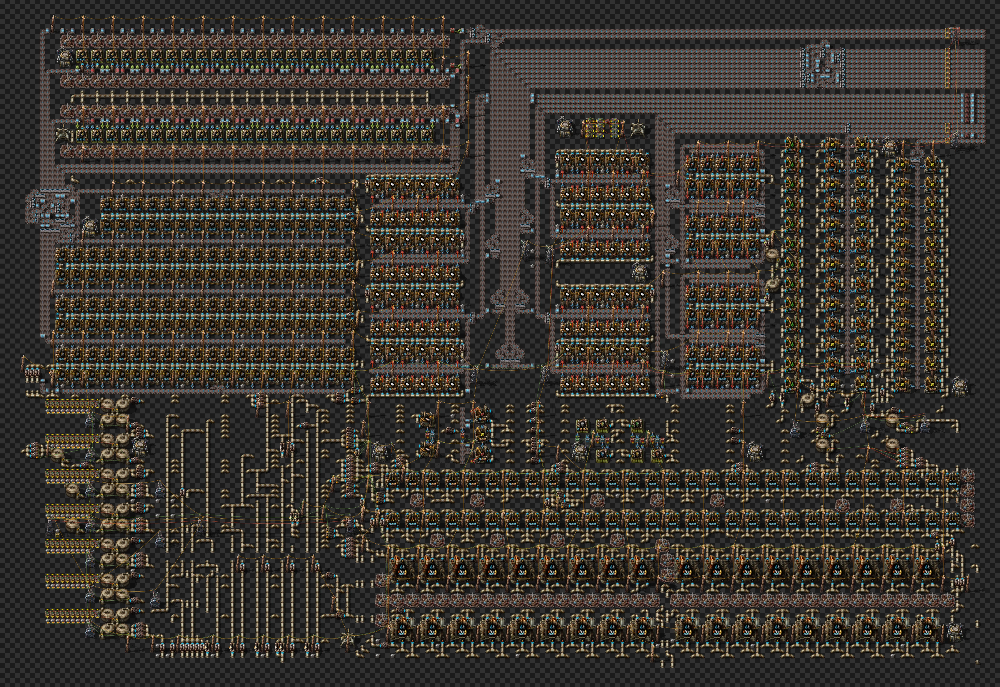

# Refinería de petróleo

Blueprint único de una refinería completa para Factorio 2.0.77, juego base (sin Space Age).

- Archivo: [`oil-refinery.txt`](oil-refinery.txt) — cadena de blueprint; en el juego, el nombre es `refinaria v3 (plastic feed + acid water)`.
- Esta es siempre la versión actual. Las versiones anteriores quedan en el historial de git (`git log -p -- blueprints/oil-refinery/`).



## Qué contiene

| Elemento | Valor |
|---|---|
| Entidades | 9899 |
| Área | 193 × 129 casillas |
| Refinerías (`advanced-oil-processing`) | 36 |
| Plantas químicas | 416 |
| Máquinas de ensamblaje 3 | 54 |
| Faros | 162 |
| Módulos | 1300 × `speed-module-3`, 570 × `productivity-module-3` |
| Bombas de fluidos / cisternas | 163 / 38 |
| Robopuertos | 11 |

Producción (máquinas por receta): plástico 96, combustible sólido 120 (petróleo ligero) + 34 (gas),
combustible de cohete 48, baterías 40, azufre 39, ácido sulfúrico 12, lubricante 13,
craqueo de petróleo ligero 41 y de petróleo pesado 17, explosivos 2, munición de lanzallamas 2 y barriles.

Cada bloque de plástico tiene 48 plantas químicas (1 `speed-module-3` + 2 `productivity-module-3`, sin faro) y consume 1152 de gas/s.

## Entradas

El blueprint tiene 9 entradas externas, todas en el borde sur (coordenadas del blueprint):

- Petróleo crudo: 2 tuberías subterráneas en (-275.5, 499.5), que pasa por las cisternas, y (-273.5, 499.5), directa al banco oeste,
  y la línea del banco este (x entre -176.5 y -120.5). **Conecta las dos tuberías subterráneas.** Las 36 refinerías solo llegan al 100 %
  con las dos; con solo la primera, el banco oeste queda en 54–75 %. Con todo conectado, las refinerías consumen 3604/s de
  petróleo crudo (medido).
- Agua: 5 tuberías subterráneas en y = 499.5 (x de -271.5 a -267.5) y la línea del banco este (x entre -174.5 y -115.5).

## Resultados medidos en el juego

Prueba automatizada en Factorio 2.0.77 headless, con fuentes infinitas solo en las 9 entradas externas (las bombas internas
de entrada se ponen a prueba), todas las salidas evacuando y todos los objetos suministrados:

| Indicador | Resultado |
|---|---|
| Refinerías | 100,0 % (36/36) |
| Ácido sulfúrico | 89 %, 0 % del tiempo sin agua (9 % con la salida llena) |
| Baterías | 100 % |
| Cisternas de agua del bloque de ácido | 60 % |
| Agua entregada | 5018/s |
| Petróleo crudo consumido | 3604/s |

En otros regímenes: con gas de sobra en los productores, o con solo el plástico evacuando, las 96 plantas de plástico quedan al 100 %.

## Límites conocidos

- Con todo consumiendo, la demanda de gas (~4800/s) es mayor que la producción (~2160/s + craqueo). Resultado: plástico 49 %,
  azufre 66 % y combustible sólido a partir de gas 0 %. No es un cuello de botella de las bombas, es el balance de producción.
- En ese régimen de escasez, los dos bloques de plástico tienen la misma prioridad (`petroleum-gas > 95000`); el combustible sólido
  a partir de gas (`> 97000`) recibe menos.

## Historial

Los cambios futuros quedan en el historial de git. Resumen de las versiones anteriores a él:

- **v3 — agua duplicada en el bloque de ácido sulfúrico** (22 entidades, 2 cables). Dos bombas paralelas a las que ya existían:
  P1 junto a la bomba (-116.5, 485), que lleva agua del banco este al ramal del bloque, y P2 junto a la bomba (-127, 453.5),
  que llena la cisterna de agua del bloque (condición `water < 23500`, cable verde a la cisterna). El ácido sulfúrico pasó del 66 % al 89 %,
  las baterías del 81 % al 100 % y el agua entregada de 4619/s a 5018/s.
- **v2 — alimentación de gas del bloque derecho de plástico** (7 entidades nuevas, 2 modificadas, 3 cables). El bloque derecho solo
  recibía gas por una bomba con la condición `petroleum-gas > 99000`, y las cisternas quedaban en ~97k: en el régimen de escasez se paraba
  (0 %) mientras el izquierdo quedaba al 100 %. Dos bombas paralelas con `> 95000`, igual que en el bloque izquierdo, y un poste eléctrico mediano.
- **Original** — blueprint base del que partieron los dos cambios.

Cada cambio se verificó con el modelo de fluidos (ningún segmento ganó tuberías ni conexiones además de las previstas, ninguna casilla
superpuesta) y en el juego (0 segmentos con mezcla de fluidos).

## Cómo probarlo

Desde la raíz del repositorio (necesita Factorio instalado; ver [`scripts/README.md`](../../scripts/README.md)):

```
python3 scripts/fluid/make_full_test.py scripts/ingame/data/scenarios/fluid-test/tests.lua atual-inlet=blueprints/oil-refinery/oil-refinery.txt
./scripts/run_fluid.sh 600 && python3 scripts/fluid/balance.py
```

El sufijo de la etiqueta elige el régimen: `-inlet` (fuentes solo en las entradas externas), `-surplus` (gas infinito en los productores),
`-plasticonly` (solo se evacua el plástico); sin sufijo, producción real.
