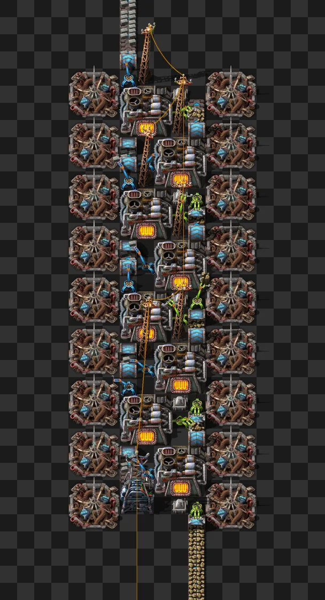

# Horno de ladrillos de piedra

Blueprint que transforma piedra en ladrillos de piedra: ocho hornos eléctricos con módulos de productividad 3, rodeados por dieciocho faros con módulos de velocidad 3. Se alimenta con una cinta transportadora exprés llena de piedra y entrega los ladrillos en otra cinta transportadora exprés.

- Archivo: [`stone-brick-smelter.txt`](stone-brick-smelter.txt) — cadena de blueprint; en el juego, el nombre es `Stone smelter`.
- Esta es siempre la versión actual. Las versiones anteriores quedan en el historial de git.



## Qué contiene

| Elemento | Valor |
|---|---|
| Entidades | 73 |
| Área | 11 × 29 casillas |
| Hornos eléctricos (`electric-furnace`) | 8 |
| Faros (`beacon`) | 18 |
| Módulos | 36 × `speed-module-3`, 16 × `productivity-module-3` |
| Insertadores rápidos (`fast-inserter`) | 8 |
| Insertadores de lotes (`bulk-inserter`) | 8 |

## Entradas y salidas

El blueprint tiene una entrada y una salida, ambas en cintas transportadoras exprés que avanzan hacia el norte (coordenadas del blueprint, sin girar):

- Entrada: piedra, por el extremo sur de la columna de la derecha. Conecta una cinta que lleve solo piedra: ningún insertador del blueprint tiene filtro, así que, si hay en la cinta otro objeto que los hornos acepten, nada impide que los insertadores lo metan en los hornos.
- Salida: ladrillos de piedra, por el extremo norte de la columna de la izquierda (la cinta transportadora subterránea exprés de salida).
- Energía: el blueprint no incluye generación de energía. La subestación eléctrica (`substation`) del extremo sur es el punto de conexión a la red eléctrica.
- Módulos: vienen como solicitudes de objetos (36 × `speed-module-3` y 16 × `productivity-module-3`); hay que entregarlos con robots o colocarlos a mano.

## Consumo y producción

En objetos por segundo, con la cinta de entrada llena y todas las tecnologías investigadas:

| Objetos por segundo | Calculado | Medido en el juego |
|---|---|---|
| Piedra consumida | 45 | 44,93 |
| Ladrillos de piedra producidos | 27 | 26,95 |

El consumo de 45/s es el límite de una cinta transportadora exprés. La producción sale de 45 ÷ 2 × 1,2: 2 piedras dan 1 ladrillo, y los 2 módulos de productividad 3 de cada horno suman un 20 %. La salida es el 60 % de una cinta transportadora exprés. La potencia eléctrica medida en ese régimen es de 20,53 MW.

## Resultados medidos en el juego

Prueba automatizada en Factorio 2.0.77 sin interfaz gráfica (escenario `smelter-test`): una cinta de piedra siempre llena (cofre infinito y cargador exprés), la salida evacuando y la energía procedente de una interfaz de energía eléctrica, con 60 s de calentamiento y 60 s de medición. La potencia eléctrica se lee después: la interfaz de energía eléctrica deja de producir y la prueba mide, durante 10 s, cuánto de la reserva de la interfaz consume el blueprint. La prueba se ejecuta en dos superficies a la vez: con todas las tecnologías investigadas y sin ninguna.

| Indicador | Todas las tecnologías | Ninguna tecnología |
|---|---|---|
| Piedra consumida | 44,93/s | 21,83/s |
| Ladrillos de piedra producidos | 26,95/s | 13,12/s |
| Tiempo de trabajo del último horno de la fila | 53,9 % | 47,8 % |
| Tiempo de trabajo de los otros siete hornos | 93,4 % a 100 % | 43,1 % a 47,6 % |
| Potencia eléctrica | 20,53 MW | 15,12 MW |

Sin ninguna tecnología investigada, al final de la medición los ocho insertadores de lotes estaban trabajando y cuatro hornos estaban sin ingredientes: esos insertadores pasan a ser el límite, y la salida baja a 13,12/s.

## Cómo se probó

Prueba en el juego, con el escenario `smelter-test`: 17 comprobaciones, todas superadas.

- La cadena se importa sin errores, y el juego lee su nombre y su descripción.
- Las 73 entidades y los 52 módulos coinciden con la cadena, contados a partir del JSON decodificado.
- Una única red eléctrica conecta el blueprint con la fuente de energía, y ninguna máquina se queda sin energía.
- La cinta llena da el consumo y la producción calculados arriba, y todos los hornos trabajan.

La imagen principal se capturó en el juego, con interfaz gráfica, en un escenario de laboratorio con el blueprint construido, con energía y alimentado, en el instante en que los ocho hornos estaban en funcionamiento. Ese escenario de captura no forma parte del repositorio.

El validador del catálogo también confirmó que la cadena es válida y solo usa objetos del juego base (versión 2.0.77).

## Cómo probarlo

Para ejecutar la prueba en macOS, con Factorio instalado desde Steam (la versión probada es la 2.0.77), desde la raíz del repositorio:

```
scripts/run_smelter_test.sh
```

El script exporta la cadena, ejecuta el escenario sin interfaz gráfica (el servidor solo escucha en 127.0.0.1) y termina con código 0 solo si se superan todas las comprobaciones. Está escrito en zsh; para usar otra ruta del ejecutable, define la variable `FACTORIO_BIN` (más detalles en [scripts/README.md](../../scripts/README.md)).

## Límites conocidos

- El blueprint necesita tecnologías investigadas: sin ninguna, la salida baja a 13,12 ladrillos/s. La prueba no distingue qué tecnología marca la diferencia.
- El último horno de la fila, el del norte, al final de la cinta de piedra, recibe solo la piedra que sobra: con todas las tecnologías investigadas trabajó el 53,9 % del tiempo, frente al 93,4 % a 100 % de los otros siete.
- El blueprint no incluye generación de energía; a plena producción consume 20,53 MW.
